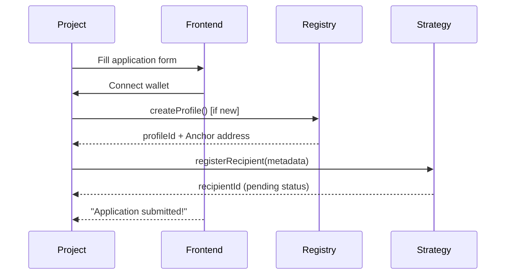
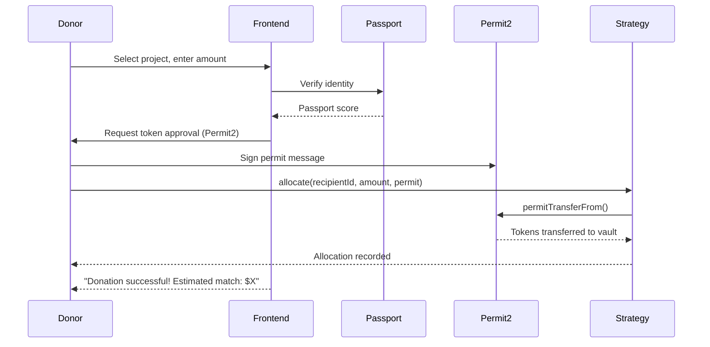
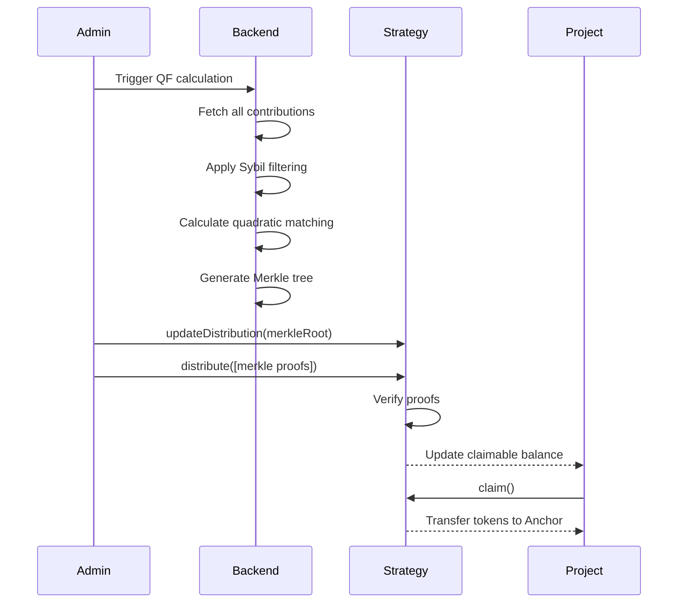

# Such.Fund - Quadratic Funding Platform Architecture

## Executive Summary

**Such.Fund** is a decentralized quadratic funding (QF) platform built on Allo Protocol v2, enabling communities to democratically allocate funding to projects through a mechanism that amplifies small individual contributions.

**Core Value Proposition:**
- Democratic funding allocation where many small supporters have more influence than a few large donors
- Transparent, on-chain tracking of all contributions
- Sybil-resistant through Gitcoin Passport integration
- Low-cost operation on Layer 2 networks
- Non-custodial donations with cryptographic verification

---

## 1. System Architecture

### 1.1 High-Level Architecture

```
┌─────────────────────────────────────────────────────────────┐
│                    SUCH.FUND PLATFORM                        │
├─────────────────────────────────────────────────────────────┤
│                                                               │
│  ┌───────────────┐  ┌──────────────┐  ┌──────────────┐     │
│  │   Frontend    │  │   Backend    │  │  Indexer     │     │
│  │  (Next.js)    │  │  (Node.js)   │  │  (The Graph) │     │
│  └───────┬───────┘  └──────┬───────┘  └──────┬───────┘     │
│          │                  │                  │              │
│          └──────────────────┼──────────────────┘              │
│                             │                                 │
└─────────────────────────────┼─────────────────────────────────┘
                              │
┌─────────────────────────────┼─────────────────────────────────┐
│                    BLOCKCHAIN LAYER                           │
├─────────────────────────────┼─────────────────────────────────┤
│                             │                                 │
│  ┌────────────────────────────────────────────────┐          │
│  │         Allo Protocol Core Contracts            │          │
│  │  ┌──────────┐  ┌──────────┐  ┌──────────┐     │          │
│  │  │Registry  │  │   Allo   │  │  Anchor  │     │          │
│  │  │   .sol   │  │   .sol   │  │   .sol   │     │          │
│  │  └──────────┘  └──────────┘  └──────────┘     │          │
│  └────────────────────────────────────────────────┘          │
│                             │                                 │
│  ┌────────────────────────────────────────────────┐          │
│  │      QF Strategy Contract (Donation Voting)     │          │
│  │  DonationVotingMerkleDistributionVaultStrategy  │          │
│  └────────────────────────────────────────────────┘          │
│                             │                                 │
│  ┌────────────────────────────────────────────────┐          │
│  │         Identity & Payments Layer               │          │
│  │  ┌──────────────┐  ┌────────────────────┐     │          │
│  │  │ Gitcoin      │  │   Permit2 (Uniswap)│     │          │
│  │  │ Passport     │  │   for transfers    │     │          │
│  │  └──────────────┘  └────────────────────┘     │          │
│  └────────────────────────────────────────────────┘          │
│                                                               │
│           Base / Arbitrum / Optimism (L2 Network)            │
└───────────────────────────────────────────────────────────────┘
```

### 1.2 Core Components

#### A. Smart Contracts (Blockchain Layer)

**1. Allo Protocol Core (Deployed - Use Existing)**
- **Registry.sol** - Universal project registry
  - Address: `0x4AAcca72145e1dF2aeC137E1f3C5E3D75DB8b5f3`
  - Manages project profiles & identities
  - Deploys Anchor contracts for each project

- **Allo.sol** - Central pool management
  - Address: `0x1133eA7Af70876e64665ecD07C0A0476d09465a1`
  - Creates funding rounds (pools)
  - Manages fund allocation & distribution
  - Handles platform fees & treasury

- **Anchor.sol** - Project wallet contracts
  - Auto-deployed per project
  - Isolated execution environment
  - Receives allocated funds

**2. QF Strategy Contract (Deployed - Use Existing)**
- **DonationVotingMerkleDistributionVaultStrategy**
  - Address: `0x787eC93Dd71a90563979417879F5a3298389227f` (already deployed)
  - Handles donation-based voting
  - Stores contributions in vault
  - Uses Merkle trees for efficient distribution
  - Integrates with Permit2 for gasless approvals

**3. Custom Extensions (To Build)**
- **SuchFundPoolFactory.sol**
  - Wrapper around Allo.createPool()
  - Such.Fund-specific pool configurations
  - Custom metadata standards
  - Fee structure management

- **SybilDefenseAdapter.sol** (Optional)
  - Integrates multiple identity providers
  - Gitcoin Passport verification
  - Custom on-chain reputation scoring
  - Blacklist management

#### B. Backend Services

**1. QF Calculation Engine**
```typescript
// Core responsibility: Calculate quadratic matching
// Technology: Node.js + TypeScript
// Database: PostgreSQL

Features:
- Fetch all contributions from on-chain events
- Apply Sybil filtering (Gitcoin Passport scores)
- Calculate quadratic formula: (Σ√contribution_i)²
- Generate Merkle tree of allocations
- Post Merkle root to strategy contract
```

**2. Event Indexer**
```typescript
// Technology: The Graph Protocol subgraph
// OR custom indexer with Viem

Indexed Events:
- PoolCreated (new funding rounds)
- Registered (project applications)
- Allocated (donations made)
- RecipientStatusUpdated (project approvals)
- Distributed (payouts completed)
- Claimed (projects claiming funds)
```

**3. API Server**
```typescript
// Technology: Express.js / Fastify
// Database: PostgreSQL + Redis (cache)

Endpoints:
- GET /api/rounds - List funding rounds
- GET /api/rounds/:id - Round details
- GET /api/projects - Browse projects
- GET /api/projects/:id - Project details
- GET /api/contributions/:round/:project - Get contributions
- GET /api/matching/:round - Current matching estimates
- POST /api/passport/verify - Verify Gitcoin Passport
```

#### C. Frontend Application

**Technology Stack:**
- **Framework:** Next.js 14 (App Router)
- **Styling:** TailwindCSS + shadcn/ui
- **Web3:** wagmi v2 + viem
- **State:** TanStack Query (React Query)
- **Forms:** React Hook Form + Zod

**Pages:**
```
/                        - Landing page
/rounds                  - Browse active rounds
/rounds/:id              - Round details & donation interface
/rounds/:id/projects     - Projects in round
/projects/:id            - Project profile
/projects/create         - Submit project (register)
/dashboard               - User dashboard (donations, projects)
/admin/rounds/create     - Create new round (pool managers)
/admin/rounds/:id        - Manage round, review projects
```

---

## 2. User Flows

### 2.1 Project Submission Flow



### 2.2 Donation (Allocation) Flow



### 2.3 Payout Distribution Flow



---

## 3. Technical Implementation Plan

### Phase 1: MVP (Weeks 1-4)

**Week 1: Smart Contract Setup**
- [ ] Deploy Allo core contracts to testnet (or use existing)
- [ ] Deploy DonationVotingMerkleDistribution strategy
- [ ] Create SuchFundPoolFactory wrapper
- [ ] Write deployment scripts
- [ ] Test on Arbitrum Sepolia

**Week 2: Backend Foundation**
- [ ] Set up Node.js + Express API server
- [ ] Set up PostgreSQL database schema
- [ ] Create The Graph subgraph for event indexing
- [ ] Implement basic QF calculation engine
- [ ] Test Merkle tree generation

**Week 3: Frontend Core**
- [ ] Next.js project setup + TailwindCSS
- [ ] Wallet connection (RainbowKit / ConnectKit)
- [ ] Browse rounds page
- [ ] Project listing page
- [ ] Donation flow UI
- [ ] Connect to testnet contracts

**Week 4: Integration & Testing**
- [ ] Integrate Gitcoin Passport SDK
- [ ] End-to-end testing (create round → donate → distribute)
- [ ] Deploy to testnet
- [ ] Internal testing & bug fixes

### Phase 2: Enhanced Features (Weeks 5-8)

**Week 5: Project Management**
- [ ] Project profile pages
- [ ] Rich metadata (images, milestones, team)
- [ ] Project application flow
- [ ] Admin review interface

**Week 6: Round Management**
- [ ] Create round UI for admins
- [ ] Round configuration (dates, matching pool, strategy)
- [ ] Round status management (registration → allocation → distribution)
- [ ] Automated round state transitions

**Week 7: Analytics & UX**
- [ ] Real-time matching estimates
- [ ] Contribution history
- [ ] Round statistics dashboard
- [ ] Email notifications (optional)
- [ ] Social sharing features

**Week 8: Security & Optimization**
- [ ] Smart contract audit (external)
- [ ] Frontend security review
- [ ] Gas optimization
- [ ] Load testing
- [ ] Bug bounty program setup

### Phase 3: Launch (Weeks 9-10)

**Week 9: Mainnet Preparation**
- [ ] Deploy to mainnet (Arbitrum / Base)
- [ ] Verify contracts on block explorers
- [ ] Set up monitoring (Tenderly, Defender)
- [ ] Create documentation
- [ ] Prepare launch marketing materials

**Week 10: Launch**
- [ ] Soft launch with pilot round
- [ ] Community feedback & iteration
- [ ] Public announcement
- [ ] Onboard first projects
- [ ] Monitor performance

---

## 4. Database Schema

```sql
-- Projects registered in rounds
CREATE TABLE projects (
  id TEXT PRIMARY KEY,              -- recipient_id from contract
  profile_id TEXT NOT NULL,         -- from Registry
  anchor_address TEXT NOT NULL,     -- Anchor contract
  name TEXT NOT NULL,
  description TEXT,
  website TEXT,
  twitter TEXT,
  github TEXT,
  logo_url TEXT,
  banner_url TEXT,
  created_at TIMESTAMP DEFAULT NOW(),
  updated_at TIMESTAMP DEFAULT NOW()
);

-- Funding rounds
CREATE TABLE rounds (
  id BIGINT PRIMARY KEY,            -- pool_id from Allo
  name TEXT NOT NULL,
  description TEXT,
  strategy_address TEXT NOT NULL,
  matching_pool_amount NUMERIC(78,0),
  matching_token_address TEXT,
  registration_start TIMESTAMP,
  registration_end TIMESTAMP,
  allocation_start TIMESTAMP,
  allocation_end TIMESTAMP,
  status TEXT,                      -- 'pending', 'active', 'ended', 'distributed'
  created_at TIMESTAMP DEFAULT NOW()
);

-- Project applications to rounds
CREATE TABLE applications (
  round_id BIGINT REFERENCES rounds(id),
  project_id TEXT REFERENCES projects(id),
  status TEXT,                      -- 'pending', 'accepted', 'rejected', 'appealed'
  metadata JSONB,
  created_at TIMESTAMP DEFAULT NOW(),
  PRIMARY KEY (round_id, project_id)
);

-- Individual contributions
CREATE TABLE contributions (
  id SERIAL PRIMARY KEY,
  round_id BIGINT REFERENCES rounds(id),
  project_id TEXT REFERENCES projects(id),
  donor_address TEXT NOT NULL,
  amount NUMERIC(78,0) NOT NULL,
  token_address TEXT NOT NULL,
  tx_hash TEXT NOT NULL,
  block_number BIGINT NOT NULL,
  passport_score NUMERIC(4,2),      -- Gitcoin Passport score (0-100)
  is_valid BOOLEAN DEFAULT true,    -- Pass Sybil check?
  created_at TIMESTAMP DEFAULT NOW()
);

-- QF calculations & distributions
CREATE TABLE distributions (
  round_id BIGINT REFERENCES rounds(id),
  project_id TEXT REFERENCES projects(id),
  total_contributed NUMERIC(78,0),
  num_contributors INT,
  quadratic_score NUMERIC(78,0),    -- (Σ√contribution)²
  matching_amount NUMERIC(78,0),
  merkle_proof JSONB,
  claimed BOOLEAN DEFAULT false,
  claimed_at TIMESTAMP,
  PRIMARY KEY (round_id, project_id)
);

-- Gitcoin Passport cache
CREATE TABLE passport_scores (
  address TEXT PRIMARY KEY,
  score NUMERIC(4,2),
  stamps JSONB,
  last_updated TIMESTAMP DEFAULT NOW()
);
```

---

## 5. Key Technical Decisions

### 5.1 Blockchain Network Choice

**Recommendation: Arbitrum One**

| Network    | Pros | Cons |
|------------|------|------|
| **Arbitrum** | ✅ Lowest fees ($0.10-0.50/tx)<br>✅ High throughput<br>✅ Large ecosystem<br>✅ Allo deployed | ❌ Slightly less mainstream than Base |
| **Base** | ✅ Coinbase backing<br>✅ Growing fast<br>✅ Good UX<br>✅ Allo deployed | ❌ Newer, less proven |
| **Optimism** | ✅ Retroactive PGF culture<br>✅ Allo deployed | ❌ Higher fees than Arbitrum |

**Decision:** Launch on **Arbitrum** for lowest costs, expand to Base in Phase 2.

### 5.2 Identity/Sybil Resistance

**Recommendation: Gitcoin Passport + On-chain Heuristics**

**Tier 1 (MVP):**
- Gitcoin Passport integration
- Minimum threshold score (e.g., 20+)
- Free to use, battle-tested

**Tier 2 (Future):**
- Wallet age verification
- Transaction history analysis
- Token holdings threshold
- Social graph clustering

**Implementation:**
```typescript
async function verifySybilResistance(address: string): Promise<boolean> {
  // Fetch Passport score
  const passport = await fetchPassportScore(address);

  // Minimum threshold
  if (passport.score < 20) return false;

  // Check wallet age (optional - on-chain)
  const walletAge = await getWalletAge(address);
  if (walletAge < 180) return false; // 6 months

  return true;
}
```

### 5.3 QF Calculation: Off-chain vs On-chain

**Decision: Hybrid Off-chain Calculation + On-chain Verification**

**Why Off-chain:**
- Quadratic formula is gas-expensive on-chain
- Sybil filtering requires external data (Passport scores)
- Flexibility to iterate on formula

**On-chain Verification:**
- Merkle root posted to contract
- Projects claim with Merkle proofs
- Trustless verification
- Transparent & auditable

**Process:**
1. Backend fetches all contribution events
2. Applies Sybil filtering (Passport scores)
3. Calculates matching for each project
4. Generates Merkle tree of allocations
5. Admin posts Merkle root to contract
6. Projects claim funds with proofs

### 5.4 Fee Model

**Platform Sustainability:**
- 1.5% fee on matching pool (taken before distribution)
- OR: 0.5% fee on contributions + 1% on matching
- Managed through Allo.sol fee mechanism

**Example:**
- Matching pool: $100,000
- Platform fee (1.5%): $1,500
- Distributable matching: $98,500

---

## 6. Security Considerations

### 6.1 Smart Contract Security

**Allo Protocol:**
- ✅ Audited by multiple firms
- ✅ Battle-tested ($50M+ processed)
- ✅ Open source (AGPL-3.0)
- ⚠️ Must verify deployment addresses

**Our Custom Contracts:**
- [ ] External audit before mainnet launch
- [ ] Comprehensive test coverage (>90%)
- [ ] Use OpenZeppelin libraries
- [ ] Implement pause mechanisms
- [ ] Multisig for admin operations

### 6.2 Sybil Attack Vectors

**Attack:** User creates multiple wallets to game matching.

**Defense:**
1. Gitcoin Passport minimum score
2. Cost-of-attack analysis (make farming unprofitable)
3. Anomaly detection (similar contribution patterns)
4. Post-round auditing & clawbacks

### 6.3 Collusion Resistance

**Attack:** Projects coordinate to funnel matching to each other.

**Defense:**
1. Transparent contribution data (public on-chain)
2. Community reporting mechanisms
3. Pairwise-bounded QF (advanced - Phase 3)
4. Review suspicious patterns before distribution

### 6.4 Frontend Security

- [ ] CSP headers
- [ ] Rate limiting on API
- [ ] Input validation & sanitization
- [ ] Wallet signature verification
- [ ] No private key handling (web3 only)

---

## 7. Deployment Strategy

### 7.1 Testnet Deployment (Week 1-4)

**Network:** Arbitrum Sepolia

1. Use existing Allo deployments:
   - Registry: `0x4AAcca72145e1dF2aeC137E1f3C5E3D75DB8b5f3`
   - Allo: `0x1133eA7Af70876e64665ecD07C0A0476d09465a1`
   - Strategy: `0x787eC93Dd71a90563979417879F5a3298389227f`

2. Deploy custom contracts (if any):
   - SuchFundPoolFactory

3. Frontend: Deploy to Vercel preview

4. Backend: Deploy to Railway/Render staging

### 7.2 Mainnet Deployment (Week 9)

**Network:** Arbitrum One

1. Use production Allo deployments (same addresses as testnet)

2. Deploy custom contracts to mainnet
   - Verify on Arbiscan
   - Transfer ownership to multisig (Gnosis Safe)

3. Set up monitoring:
   - Tenderly for transaction alerts
   - OpenZeppelin Defender for automation
   - Sentry for error tracking

4. Frontend: Production deployment to Vercel

5. Backend: Production deployment to Railway/Render

---

## 8. Tech Stack Summary

### Smart Contracts
- **Language:** Solidity 0.8.19
- **Framework:** Foundry (forge) + Hardhat
- **Testing:** Forge tests
- **Deployment:** Hardhat scripts
- **Libraries:** OpenZeppelin, Solady

### Backend
- **Runtime:** Node.js 20+
- **Language:** TypeScript
- **Framework:** Express.js
- **Database:** PostgreSQL 15
- **Cache:** Redis
- **Indexer:** The Graph (subgraph)
- **Web3:** Viem v2

### Frontend
- **Framework:** Next.js 14 (App Router)
- **Language:** TypeScript
- **Styling:** TailwindCSS
- **UI Components:** shadcn/ui
- **Web3:** wagmi v2 + viem
- **Wallet:** RainbowKit / ConnectKit
- **State:** TanStack Query
- **Forms:** React Hook Form + Zod

### Infrastructure
- **Hosting (Frontend):** Vercel
- **Hosting (Backend):** Railway / Render
- **Database:** Supabase / Neon (managed Postgres)
- **Monitoring:** Tenderly, Sentry
- **Analytics:** PostHog / Plausible

---

## 9. Differentiation Strategy

### vs. Gitcoin Grants

**Similarities:**
- Same underlying protocol (Allo)
- Same QF mechanism
- Similar UX patterns

**Differentiators:**
1. **Niche Focus:** Crypto-native projects only (vs. Gitcoin's broader scope)
2. **Simpler UX:** Streamlined for crypto users, less hand-holding
3. **Lower Fees:** 1.5% vs. Gitcoin's ~2-3%
4. **Faster Rounds:** Weekly rounds vs. quarterly
5. **Community-Owned:** DAO governance (future)
6. **Multi-chain Native:** Launch on multiple L2s simultaneously
7. **Composability:** Open APIs for ecosystem integration

### Unique Features (Future)
- NFT-gated rounds (only NFT holders can vote)
- Retroactive funding rounds
- Milestone-based distributions
- Project tokens eligible for matching pool
- Cross-round reputation system

---

## 10. Success Metrics

### MVP Success (Week 4)
- [ ] 1 successful test round completed end-to-end
- [ ] 10+ projects registered
- [ ] 50+ test contributions
- [ ] QF calculation accurate
- [ ] Merkle distribution works
- [ ] 0 critical bugs

### Launch Success (Week 10)
- [ ] $50,000+ in matching pool committed
- [ ] 25+ projects funded
- [ ] 200+ unique contributors
- [ ] $10,000+ total contributions
- [ ] <$2 average transaction fee
- [ ] 95%+ uptime

### 3-Month Success
- [ ] $500,000+ total matched
- [ ] 5+ completed rounds
- [ ] 100+ projects funded
- [ ] 2,000+ unique contributors
- [ ] DAO treasury established
- [ ] Break-even on operating costs

---

## 11. Risks & Mitigations

| Risk | Impact | Mitigation |
|------|--------|------------|
| **Sybil attacks drain matching pool** | Critical | Multi-layered identity verification, anomaly detection, post-round audits |
| **Smart contract exploit** | Critical | External audit, gradual rollout, pause mechanisms, insurance |
| **Low adoption** | High | Strong launch marketing, partner with DAOs for matching pools, low fees |
| **Gitcoin competition** | Medium | Differentiate on UX, fees, speed; coexist via niche focus |
| **Regulatory uncertainty** | Medium | Legal review, no presale/securities, public goods only |
| **High gas fees** | Low | L2-only deployment (Arbitrum), batch operations |
| **Technical complexity** | Low | Use Allo Protocol (proven), incremental development, extensive testing |

---

## 12. Next Steps (Action Items)

### Immediate (This Week)
1. ✅ Clone Allo v2 repo
2. ✅ Understand core contracts
3. ✅ Document architecture
4. [ ] Set up development environment (Foundry, Node.js)
5. [ ] Create project structure
6. [ ] Initialize Git repository

### Short-term (Weeks 1-2)
1. [ ] Deploy Allo contracts to testnet
2. [ ] Create first pool using CLI
3. [ ] Build basic Next.js frontend
4. [ ] Implement wallet connection
5. [ ] Create donation flow

### Medium-term (Weeks 3-4)
1. [ ] Build QF calculation engine
2. [ ] Implement Merkle tree generation
3. [ ] Create admin interface
4. [ ] End-to-end testing
5. [ ] Prepare for MVP launch

---

## 13. Open Questions

1. **Team composition:** Solo founder or building a team?
2. **Funding:** Self-funded or seeking grants/investment?
3. **Legal structure:** DAO, LLC, or no entity?
4. **Target community:** DeFi projects? NFT projects? General crypto?
5. **Matching pool sources:** Where will matching funds come from?
   - Protocol treasuries?
   - Ecosystem grants?
   - Philanthropic donors?
6. **Governance:** Centralized initially then DAO, or DAO from day 1?

---

## Conclusion

Such.Fund leverages the battle-tested Allo Protocol to create a focused, efficient quadratic funding platform for crypto projects. By building on existing infrastructure, we can:

- **Ship fast:** MVP in 4 weeks
- **Start small:** Testnet → single L2 → multi-chain
- **Stay lean:** Minimal custom contracts, proven strategies
- **Scale smart:** Use Allo's multi-chain deployments

The architecture prioritizes:
1. ✅ Security (audited contracts, hybrid calculation)
2. ✅ Cost-efficiency (L2-only, optimized gas)
3. ✅ User experience (simple UI, fast rounds)
4. ✅ Transparency (on-chain verification, open source)

**Let's build something amazing. 🚀**
